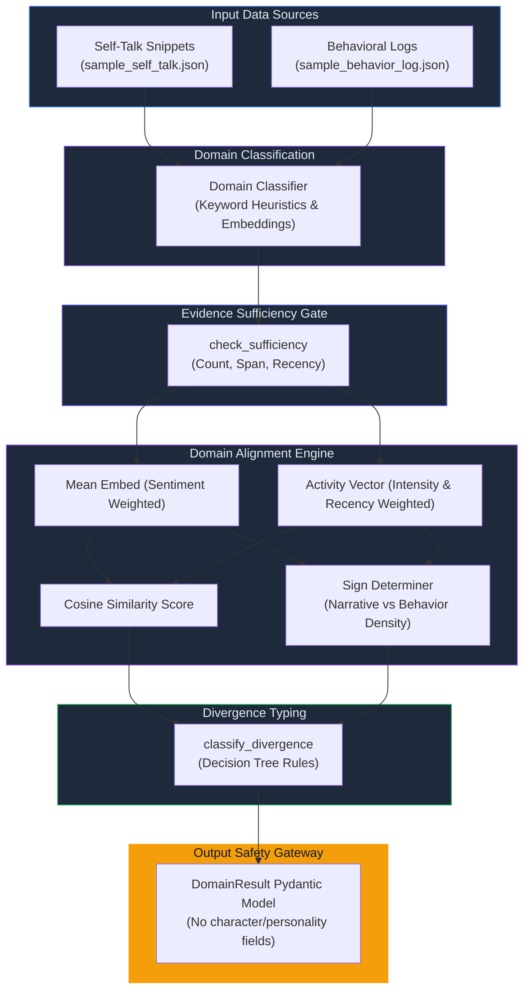

<div align="center">

# BURNER — Behavioral–Narrative Divergence Scoring Engine

### *Measure divergence. Type gaps. Gate sufficiency. Refuse characterological labels.*

[](https://www.python.org/)
[](https://huggingface.co/sentence-transformers/all-MiniLM-L6-v2)
[](https://pydantic-docs.helpmanual.io/)
[](LICENSE)

<br>

> **Burner reads what people do and what they say about themselves, measures the gap per life domain, classifies its shape, and reports results with explicit uncertainty — without making any judgment or diagnostic claims about the person producing the signal.**

<br>

| +0.72 | Overstatement | 0.84 | 11 days |
|:---:|:---:|:---:|:---:|
| Signed Score | Divergence Shape | Classification | Active Span |
| narrative vs behavior | canonical type | confidence level | temporal coverage |

</div>

---

## System Architecture



---

## How Burner Works — Step by Step

```
 ┌──────────────┐     ┌──────────────┐     ┌──────────────┐     ┌──────────────┐
 │  App Ingests │────▶│ Classify     │────▶│ Sufficiency  │────▶│ Align & Score│
 │  JSON inputs │     │ domains      │     │ check gates  │     │ cosine similarity
 └──────────────┘     └──────────────┘     └──────────────┘     └──────┬───────┘
                                                                       │
 ┌──────────────┐     ┌──────────────┐     ┌──────────────┐     ┌──────▼───────┐
 │  Rich CLI    │◀────│ Safe Pydantic│◀────│ Trend analysis│◀───▶│ Type shape   │
 │  Outputs     │     │ Output Schema│     │ Chrono split │     │ 5 categories │
 └──────────────┘     └──────────────┘     └──────────────┘     └──────────────┘
```

| Step | What Happens |
|:----:|:-------------|
| **1** | **Ingest Inputs**: Raw self-talk snippets and behavioral logs are read from JSON input files. |
| **2** | **Domain Classification**: Self-talk statements are classified into domains (`fitness`, `career`, `finance`, `social`) using keyword-matching heuristics with an embedding fallback. |
| **3** | **Sufficiency Gating**: Verification checks gate execution. Validates count floors, observation day span, and data recency. |
| **4** | **Alignment Scoring**: Computes cosine similarity between the sentiment-weighted self-talk centroid and the intensity/recency-weighted activity vector. |
| **5** | **Signing & Scoring**: The score is signed positive (narrative outpaces behavior) or negative (behavior outpaces narrative) based on relative density masses: `S = sign * (1.0 - cosine_similarity)`. |
| **6** | **Divergence Typing**: Evaluates the score magnitude (cutoff $\pm 0.35$), detects goal-oriented verbs, and checks if chronological activity progress is flat/declining. |
| **7** | **Safety Enforcement**: Passes final result parameters through the strict `DomainResult` Pydantic model (structurally free from diagnostic/characterological fields). |
| **8** | **Output Delivery**: Generates a terminal table using `rich` and writes output JSON files to `results/`. |

---

## Divergence Types

| Type | Description | Trigger Condition |
| :--- | :---------- | :---------------- |
| **`OVERSTATEMENT`** | Narrative exceeds behavior, but no active goal intentions. | Score >= +0.35 AND does not meet `ASPIRATION_GAP` conditions. |
| **`UNDERSTATEMENT`** | Behavior exceeds narrative, and does not match blind spot. | Score <= -0.35 AND does not meet `BLIND_SPOT` conditions. |
| **`BLIND_SPOT`** | Behaviorally prominent domain that is completely absent from self-talk. | Top-quartile (upper 25%) behavioral frequency across all domains, and zero self-talk entries. |
| **`ASPIRATION_GAP`** | Repeated goal-intent statements paired with flat/declining behavioral progress. | Score >= +0.35 AND self-talk contains goal-oriented language AND behavioral progress is declining. |
| **`ALIGNED`** | Stated narrative aligns closely with logged activity patterns. | Score falls within [-0.35, +0.35] boundary. |
| **`INSUFFICIENT_EVIDENCE`** | Evidence is too sparse, stale, or window too short to draw claims. | Fails sufficiency checks (abstains). |

---

## Project Structure

```
burner/
├── __init__.py           # Package orchestrator entry point
├── scorer.py             # Core divergence scoring (signed cosine gap)
├── typer.py              # Type classification with explicit decision boundaries
├── sufficiency.py        # Evidence sufficiency gate + abstention logic
├── output.py             # Safe output schema (Pydantic) — no characterological fields
├── domain_classifier.py  # Maps self-talk snippets to domains
├── embedder.py           # sentence-transformers wrapper
└── utils.py              # Cosine similarity and sentiment heuristics

tests/
├── test_type_boundaries.py   # Critical boundary conditions for all four types
├── test_abstention.py        # Sufficiency gate + abstention behavior
├── test_output_schema.py     # Schema safety assertions
└── test_scorer.py            # Scorer unit tests

results/
├── fitness_example.json      # Typed result (Overstatement)
├── career_example.json       # Typed result (Understatement)
├── finance_example.json      # Typed result (Aspiration Gap)
└── social_abstention_example.json   # Deliberate abstention case (window too short)

data/
├── sample_behavior_log.json
└── sample_self_talk.json

run.py                # Command-Line Interface entrypoint
requirements.txt      # Project dependencies
decisions.md          # Alignment method, type boundaries, and safety constraints
```

---

## Input Format

**Behavioral Log** (`data/sample_behavior_log.json`):

```json
[
  {
    "timestamp": "2026-06-01T07:00:00Z",
    "text": "Quick 20 min jog",
    "domain": "fitness",
    "intensity": 0.5
  }
]
```

**Self-Talk Snippets** (`data/sample_self_talk.json`):

```json
[
  "I hit the gym 5 times a week, eat clean, and work out every single day."
]
```

---

## Output Format

Each analyzed domain produces a `DomainResult` JSON object:

```json
{
  "domain": "fitness",
  "divergence_score": 0.72,
  "divergence_type": "OVERSTATEMENT",
  "confidence": 0.84,
  "evidence_count": 8,
  "observation_days": 12,
  "abstained": false,
  "abstention_reason": null
}
```

When evidence is insufficient to make a claim:

```json
{
  "domain": "social",
  "divergence_score": 0.0,
  "divergence_type": "ALIGNED",
  "confidence": 0.0,
  "evidence_count": 4,
  "observation_days": 2,
  "abstained": true,
  "abstention_reason": "observation window too short"
}
```

> **Safety Constraint**: The output schema contains **no fields** for personality, character, mental state, motivation, or any other person-referencing attribute. This safety is structural, not a post-execution filter.

---

## Alignment Method

Burner uses `sentence-transformers` (`all-MiniLM-L6-v2`) to embed self-talk and behavioral log descriptions, then computes the signed cosine gap between the sentiment-adjusted narrative centroid and the activity-weighted behavior vector.

The sign is determined by comparing narrative density (sentiment-weighted count) against behavioral density (intensity and recency-weighted sum) — positive means narrative leads, negative means behavior leads.

**Known failure modes (documented in `decisions.md`):**
- Domain-specific jargon can degrade embedding quality; mitigated by the confidence floor in the sufficiency gate.
- Raw cosine similarity is volume-insensitive; corrected via separate density measures.
- Non-English input is not currently supported.

---

## Evidence Sufficiency Rules

Every classification is gated behind five checks. All must pass, or the system returns an abstained `DomainResult` with the appropriate reason:

1. **Count floor (behavior)**: At least **3 behavioral entries** for the domain.
2. **Count floor (talk)**: At least **1 self-talk snippet** for the domain (except in pre-checked `BLIND_SPOT` cases).
3. **Temporal span**: Behavioral entries must span at least **3 distinct calendar days**.
4. **Recency window**: The most recent behavioral entry must fall within the **14-day recency window** relative to the reference date.
5. **Confidence floor**: The computed confidence score must be **≥ 0.55**. Below this threshold the result is marked as abstained.

---

## Configuration

Sufficiency thresholds and type boundaries are configurable via `SufficiencyConfig`:

```python
from datetime import datetime
from burner.sufficiency import SufficiencyConfig

cfg = SufficiencyConfig(
    min_behavior_entries=3,
    min_talk_entries=1,
    min_span_days=3,
    stale_threshold_days=14,
    confidence_floor=0.55,
    reference_date=datetime(2026, 6, 13)
)
```

Any change to a threshold should also update `decisions.md` to keep the code and design documentation in sync.

---

## Running Tests

Verify all edge cases, typing boundaries, sufficiency gates, and safety constraints using `pytest`:

```bash
# Run all tests
PYTHONPATH=. pytest -v

# Run with coverage report
PYTHONPATH=. pytest --cov=burner tests/ -v
```

The test suite covers:
- Boundary cutoff at exactly `+0.35` typing as `OVERSTATEMENT`.
- Score of `+0.34` typing as `ALIGNED`.
- Goal-language checks for `ASPIRATION_GAP` detection.
- Single-day observation windows raising `InsufficientEvidence` for "observation window".
- Prohibiting diagnostic field names in `DomainResult`.

---

## Quickstart

### Prerequisites
- Python 3.11+ (Python 3.14 supported)
- CPU environment (runs offline, model downloads and caches locally on first run)

### Running Locally
```bash
# 1 · Setup and activate environment
python3 -m venv .venv
source .venv/bin/activate

# 2 · Install dependencies
pip install -r requirements.txt

# 3 · Run divergence scoring pipeline
python run.py \
  --behavior data/sample_behavior_log.json \
  --self-talk data/sample_self_talk.json \
  --domains fitness --domains career --domains finance --domains social \
  --output results/
```

Results will be printed as a table to the terminal and written to the `results/` folder.

---

## Refusal to Claim

From `decisions.md`:

> Burner does not infer why a gap exists. The divergence type describes the shape of the gap — not its origin, its meaning, or anything about the person producing it. Medical, diagnostic, and characterological statements are impossible by construction: the output schema has no field for them.

---

## License

This project is licensed under the MIT License — see the [LICENSE](LICENSE) file for details.

---

<div align="center">

**BURNER** — AI/ML Divergence Scoring Engine

*Sentence Transformers · Pydantic · NumPy · Pytest*

Built as a submission for the Chronis AI/ML Engineering Assessment

</div>
